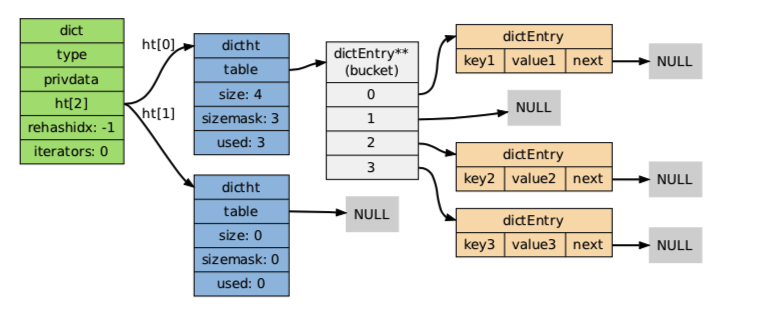

# 字典:dict

[源码](https://github.com/antirez/redis/blob/unstable/src/dict.h)

在redis中，字典的主要用途有以下两点：
- 实现数据库键空间（key space）
- 用做hash类型键的其中一种底层实现


## 哈希表 dictht
```c
// 哈希表
typedef struct dictht {
    // 哈希表节点指针数组（即桶 bucket）
    // 每个元素都是一个指向 dictEntry 结构的指针
    dictEntry **table;      
    unsigned long size;     // 指针数组的大小
    unsigned long sizemask; // 指针数组的长度掩码，用于计算索引值
    unsigned long used;     // 哈希表现有的节点数量
} dictht;

typedef struct dictEntry {
    void *key;          // 键
    union {             // 值
        void *val;
        uint64_t u64;
        int64_t s64;
        double d;
    } v;
    // 后继节点的指针
    // 多个 dictEntry 可以通过next指针串成链表
    struct dictEntry *next;
} dictEntry;

```

## 字典 dict
```c
// 字典
// 每个字典使用两个哈希表，用于渐进式 rehash
typedef struct dict {
    dictType *type; // 特定的类型处理函数
    void *privdata; // 类型处理函数的私有数据
    dictht ht[2];   // 哈希表（2个）
    long rehashidx; // 记录rehash进度的标志，值为-1表示rehash未进行
    unsigned long iterators; // 当前正在运作的安全迭代器数量
} dict;

typedef struct dictType {
    uint64_t (*hashFunction)(const void *key);
    void *(*keyDup)(void *privdata, const void *key);
    void *(*valDup)(void *privdata, const void *obj);
    int (*keyCompare)(void *privdata, const void *key1, const void *key2);
    void (*keyDestructor)(void *privdata, void *key);
    void (*valDestructor)(void *privdata, void *obj);
} dictType;
```



ht[0]->table 的空间分配将在第一次往字典添加键值对时进行；
ht[1]->table 的空间分配将在rehash开始时进行

## 添加
```c
# 使用字典设置的hash函数，计算key的哈希值
hash = dict->type->hashFunction(key);

#计算索引值
#根据情况不同，ht[x]可能是ht[0]或ht[1]
index = hash & dict->ht[x].sizemask;

#放在对应链表的表头位置
entry = dictEntry(key,value);
entry->next=dict->ht[x]->table[index];
dict->ht[x]->table[index]=entry

```
## 冲突
当两个或以上key被分配到同一个索引上
redis解决冲突的方法是链地址法（separate chainning）
程序总是将新节点添加到链表的表头位置（复杂度O(1)），排在其他已有节点的前面
## rehash
对于使用链地址法来解决碰撞问题的哈希表dictht来说，
哈希表的性能依赖于它的大小（size）和它所保存的节点数量（used）之间的比率：
`ratio=used/size`；
ratio=1时，性能最好
如果ratio远远大于1的话，那么哈希表就会退化为链表；
所以要进行rehash操作，对哈希表进行扩容，尽量将比率维持在1:1；

dictAdd每次想字典添加新键值对之前，都会对ht[0]的ratio进行检查，
当满足以下一个条件的话，rehash就会被激活
- 自然rehash：ratio>1，且变量dict_can_resize为true
- 强制rehash：ratio>变量 dict_force_resize_ratio(目前为5)

> dict_can_resize 为false的情况：当redis使用子进程执行后台持久化任务时（BGSAVE/BGREWRITEAOF）,
为了最大化地利用系统`copy on write`机制，程序会暂时将dict_can_resize设为false，
避免执行自然rehash，从而减少程序对内存的触碰；
但是满足强制rehash条件时，这个字典一样会被rehash

## rehash执行过程
